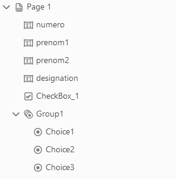

# DataToPdf

## POC : importation de données dans un pdf

Template pdf dans : 

DataToPdf/src/main/resources/pdf/template.pdf

Librairie :

```java
import com.itextpdf.text.*
```

Ajout de donnée via l'objet AcroFields

```java
// Lecture du fichier template
PdfReader reader = new PdfReader(getDir() + "template.pdf"); 
// Copie du fichier template dans un autre fichier
PdfStamper stamper = new PdfStamper(reader, new FileOutputStream(getDir() + "output.pdf")); 

// On récupère le formulaire de données
AcroFields form = stamper.getAcroFields(); 

// Ajout de données
form.setField(key, value);
form.setField(key, value);

// Fermeture des documents
stamper.close();
reader.close();
```

CheckBox :
```java
form.setField(key, "YES");
```
Exemple liste des valeurs possibles pour notre template :
```java
String[] statesCheckBox = form.getAppearanceStates("CheckBox_1");
Arrays.stream(statesCheckBox).forEach( s-> {
  System.out.println(s);
});
```
> Output pour notre projet : Off, Oui

**Les valeurs sont dépendantes de la langue du fichier pdf.**

TODO: chercher comment paramétrer la langue

OptionsList :
```java
form.setField(key, "Choice3");
```
Exemple liste des valeurs possibles pour notre template :
```java
String[] statesCheckBox = form.getAppearanceStates("CheckBox_1");
Arrays.stream(statesCheckBox).forEach( s-> {
  System.out.println(s);
});
```
> Output pour notre projet : Off, Choice1, Choice2, Choice3

## Exemple de formulaire de données dans acrobat dc


